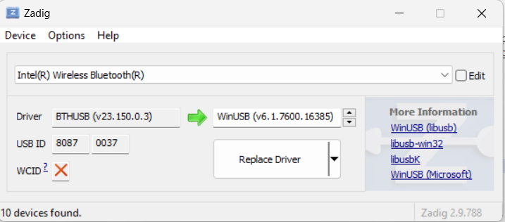

# Setup Guide

## Windows Setup

### 1. Install Python
Download and install Python 3.8+ from [python.org](https://www.python.org/downloads/)

### 2. Setup Project
```powershell
# Navigate to project directory
cd bumble_hci

# (Optional) Create and activate a virtual environment
# Recommended to keep dependencies isolated, but you can skip this
# and install directly into your system Python if you prefer.
python -m venv venv
.\venv\Scripts\Activate.ps1

# If you get an execution policy error when activating:
Set-ExecutionPolicy -ExecutionPolicy RemoteSigned -Scope CurrentUser

# Install dependencies
pip install -r requirements.txt
```

### 3. HCI Controller (USB, Built-in, or Serial)

Bumble needs direct HCI access to a Bluetooth controller.  You can use **any** of the
following — you are not limited to a USB dongle:

| Controller type | Bridge transport flag | Notes |
|---|---|---|
| USB Bluetooth dongle | `usb:0` (or `usb:1`, `usb:2` …) | Plug-and-play on Linux. Needs WinUSB on Windows (see below). |
| Built-in laptop Bluetooth (Intel, etc.) | `usb:0` after driver swap | Requires temporary WinUSB driver replacement on Windows. |
| Serial / UART HCI device (Windows) | `serial:COM5,115200` | Replace `COM5` with your actual COM port. |
| Serial / UART HCI device (Linux/Mac) | `serial:/dev/ttyUSB0,115200` | Common on embedded dev boards. |
| TCP (already bridged) | `tcp-client:127.0.0.1:9001` | Default — connect to a running bridge. |

---

#### Windows — Replacing the Driver with WinUSB (Zadig)

Windows locks Bluetooth controllers behind its own `BTHUSB` kernel driver, which
prevents `libusb` (and therefore Bumble) from talking to the device directly.  The
solution is to temporarily replace that driver with **WinUSB** using
[Zadig](https://zadig.akeo.ie/).

> **This works for any Bluetooth USB device** — a dedicated USB dongle *or* the
> built-in Intel / Qualcomm / Broadcom adapter already in your laptop.

**Step-by-step:**

1. Download **Zadig** from <https://zadig.akeo.ie/> and run it (no install needed).
2. In Zadig, open **Options → List All Devices** so every USB device is shown.
3. In the device drop-down, select your Bluetooth controller.  
   For a built-in Intel adapter it appears as **Intel(R) Wireless Bluetooth(R)**;  
   a USB dongle usually shows a vendor name or "Bluetooth Adapter".
4. Make sure the right-hand driver is set to **WinUSB**.
5. Click **Replace Driver** and wait for it to finish.



> The screenshot above shows an Intel built-in adapter (`USB ID 8087:0037`)
> with the `BTHUSB` driver being replaced by `WinUSB (v6.1.7600.16385)`.

After the replacement, run the bridge:

```powershell
bumble-hci-bridge usb:0 tcp-server:127.0.0.1:9001
```

If `usb:0` is not recognised, try `usb:1`, `usb:2`, etc. to find the right index.

---

#### Restoring the original Windows Bluetooth driver

WinUSB disables the normal Windows Bluetooth stack while it is active.  To restore it:

1. Open **Device Manager** (`Win + X → Device Manager`).
2. Expand **Universal Serial Bus devices** (or **Other devices**).  
   Your adapter will appear there as a generic USB device instead of under *Bluetooth*.
3. Right-click the device → **Update driver**.
4. Choose **Browse my computer for drivers → Let me pick from a list of available
   drivers on my computer**.
5. Select **Bluetooth** from the device-type list, then choose the original vendor
   driver (e.g. *Intel(R) Wireless Bluetooth(R)*).
6. Click **Next** and let Windows reinstall the driver.

The adapter will reappear under the *Bluetooth* node and normal Windows Bluetooth
(including the system tray icon) will work again.

> **Tip:** You can switch back and forth as many times as you like — use WinUSB
> while developing/testing with Bumble, restore the original driver when you need
> normal Windows Bluetooth.

---

### 4. Run Application

**Terminal 1 - HCI Bridge:**
```powershell
bumble-hci-bridge usb:0 tcp-server:127.0.0.1:9001
```

**Terminal 2 - Main App:**
```powershell
python src\main.py
```

### 5. Run After Pip Install (Installed Commands)

If users install the package (`pip install HCIEMU`), they can run the app using
installed commands instead of repo paths:

```powershell
# Terminal 1
BRIDGE

# Terminal 2
HCI
```

Custom transport examples:

```powershell
BRIDGE usb:1 tcp-server:127.0.0.1:9001
BRIDGE serial:COM5,115200 tcp-server:127.0.0.1:9001
```

Aliases:
- `hciemu` and `bumble-hci-menu` are aliases for `HCI`.

Note: repo-clone users can still run [HCI.bat](HCI.bat) and [BRIDGE.bat](BRIDGE.bat).

## Linux Setup

### 1. Install Dependencies
```bash
# Ubuntu/Debian
sudo apt update
sudo apt install python3 python3-pip python3-venv libusb-1.0-0-dev

# Fedora
sudo dnf install python3 python3-pip libusb-devel

# Arch
sudo pacman -S python python-pip libusb
```

### 2. Setup Project
```bash
cd bumble_hci

# (Optional) Create and activate a virtual environment
# Recommended to keep dependencies isolated, but not required.
python3 -m venv venv
source venv/bin/activate

# Install dependencies
pip install -r requirements.txt
```

### 3. USB Permissions
```bash
# Add user to dialout group
sudo usermod -a -G dialout $USER

# Or create udev rule for your adapter
sudo nano /etc/udev/rules.d/99-bluetooth.rules

# Add (replace XXXX:YYYY with your vendor:product ID):
SUBSYSTEM=="usb", ATTRS{idVendor}=="XXXX", ATTRS{idProduct}=="YYYY", MODE="0666"

# Reload rules
sudo udevadm control --reload-rules
sudo udevadm trigger

# Logout and login for group changes
```

### 4. Run Application
```bash
# Terminal 1
bumble-hci-bridge usb:0 tcp-server:127.0.0.1:9001

# Terminal 2
python src/main.py
```

## macOS Setup

### 1. Install Homebrew (if not installed)
```bash
/bin/bash -c "$(curl -fsSL https://raw.githubusercontent.com/Homebrew/install/HEAD/install.sh)"
```

### 2. Install Dependencies
```bash
brew install python@3.11 libusb
```

### 3. Setup Project
```bash
cd bumble_hci

# (Optional) Create and activate a virtual environment
# Recommended to keep dependencies isolated, but not required.
python3 -m venv venv
source venv/bin/activate

# Install dependencies
pip install -r requirements.txt
```

### 4. Run Application
```bash
# Terminal 1
bumble-hci-bridge usb:0 tcp-server:127.0.0.1:9001

# Terminal 2
python src/main.py
```

## Ellisys Setup (Optional - for HCI Capture)

### 1. Install Ellisys Bluetooth Analyzer
Download from [Ellisys website](https://www.ellisys.com/products/bta/download.php)

### 2. Configure UDP Listener
- Open Ellisys Analyzer
- Go to: **Tools → Options → UDP Listener**
- Enable UDP Listener
- Set port to **24352** (or your chosen port)
- Select data stream (Primary/Secondary/Tertiary)

### 3. Enable in Application
- Run the BLE testing app
- Choose **Option D: HCI Snoop Logging**
- Configure Ellisys host/port
- Enable capture

### 4. Verify Capture
- Perform BLE operations
- Check Ellisys Analyzer for incoming packets
- Check capture file (e.g., `hci_capture.log`)

## Troubleshooting

### "USB device not found"
- Check adapter is plugged in
- Try different USB port
- Check permissions (Linux)
- Try `bumble-hci-bridge usb:1` or `usb:2` for different adapters

### "Module not found" errors
```bash
# Ensure virtual environment is activated
# Windows
.\venv\Scripts\Activate.ps1

# Linux/Mac
source venv/bin/activate

# Reinstall dependencies
pip install -r requirements.txt
```

### "Cannot connect to tcp-server"
- Ensure HCI bridge is running in separate terminal
- Check port 9001 is not in use
- Try different port in both bridge and app

### Rich formatting not working
```bash
# Install/reinstall Rich
pip install --upgrade rich
```

### Permission denied (Linux)
```bash
# Check USB permissions
lsusb
ls -la /dev/bus/usb/001/*  # Adjust based on lsusb output

# Run with sudo temporarily to test
sudo -E python src/main.py  # -E preserves environment
```

## Verification

Test your setup:

```bash
# Check Bumble installation
bumble-hci-bridge --help

# List available USB adapters
python -c "import usb.core; print([f'USB {d.idVendor:04x}:{d.idProduct:04x}' for d in usb.core.find(find_all=True)])"

# Check Python version
python --version  # Should be 3.8+

# Test Rich library
python -c "from rich.console import Console; Console().print('[green]✓ Rich working[/green]')"
```

All checks passing? You're ready to go! 🎉

Run the application:
```bash
# Terminal 1
bumble-hci-bridge usb:0 tcp-server:127.0.0.1:9001

# Terminal 2
python src/main.py
```
